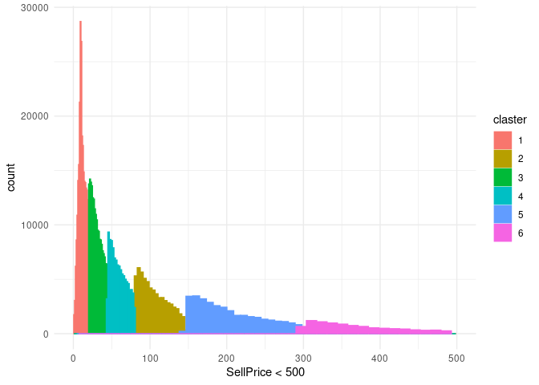

```r
#rm(list = ls())
library(tidyverse)
```

```r
test_price = read.csv("data.csv")
head(test_price)
```

```
##       id Brand SubCategoryNr Category SellPrice
## 1 452798    79          3488       36     10.92
## 2 599859    79          1485       36    112.04
## 3 183475    79          1485       36     25.09
## 4 552471    79          3282       36      1.40
## 5 589285    79          3282       36      2.28
## 6 500050    33          1496       36      0.25
```

0. Описательная статистика

```r
top_brand_all <- test_price %>% count(Brand, sort = TRUE) %>%  .[[1, 1]]
top_category_all <- test_price %>% count(Category, sort = TRUE) %>% .[[1, 1]]
top_subcategory_all <- test_price %>% count(SubCategoryNr, sort = TRUE) %>% .[[1, 1]]
tops <- tibble(Top = "Top", Brand = top_brand_all, Category = top_category_all, SubCategoryNr = top_subcategory_all) %>% column_to_rownames("Top")
```
Cамый частотный бренд, категория, подкатегория

```r
print(tops)
```

```
##     Brand Category SubCategoryNr
## Top   369       13            82
```

```r
#переопределим функции с заданными аргументами по умолчанию для 25 и 75 процентиля
quantile75 <- function(x) quantile(x, probs = 0.75)
quantile25 <- function(x) quantile(x, probs = 0.25)
fun_range <- function(x) range(x)[2]-range(x)[1]
descriptive_stat_on_top_subcategory_in_top_category_in_top_brand <- 
    test_price %>% 
    filter(Brand == top_brand_all & Category == top_category_all & SubCategoryNr == top_subcategory_all) %>%
    summarise_at('SellPrice', 
                 list(Mean_price = mean, 
                      Median_price = median, 
                      Min_price = min, 
                      Max_price = max, 
                      Q25 = quantile25, 
                      Q75 = quantile75, 
                      Range = fun_range)) %>% 
    mutate(Top = str_c('Brand:', top_brand_all, 
                       'Category:', top_category_all, 
                       'SubCategoryNr:', top_subcategory_all, 
                       sep = ' '), 
          .before = everything())
```


```r
top_categories <- c('Brand', 'Category', 'SubCategoryNr')
# создаем именованный вектор. Значения (текстовые) нужны для filter, имена нужены для summarise_at .id
# цифровые значения бренда, категории, субкатегории нужны для filter
names(top_categories) <- map2_chr(top_categories, c(top_brand_all, top_category_all, top_subcategory_all), ~str_c(.x, .y, sep = ": ")) 

descriptive_stat_on_top <- top_categories %>%  
                           syms() %>% 
                           map2_df(c(top_brand_all, top_category_all, top_subcategory_all), 
#анонимная функция фильтрует датафрейм по самому частому бренду, категории или субкатегории, считает статистику для каждого значения filter. map2_df собирает все в единый датафрейм
                                   ~(test_price %>% 
                                     filter(!!.x == .y) %>% 
                                     summarise_at('SellPrice', 
                                                  list(Mean_price = mean, 
                                                  Median_price = median, 
                                                  Min_price = min, 
                                                  Max_price = max, 
                                                  Q25 = quantile25, 
                                                  Q75 = quantile75, 
                                                  Range = fun_range))),
                                    .id = 'Top')

#соединяем два датафрейма в один
descriptive_stat_on_top <- descriptive_stat_on_top %>% bind_rows(descriptive_stat_on_top_subcategory_in_top_category_in_top_brand)
```


Размах цен для самого частотного бренда, категории, подкатегории

```r
descriptive_stat_on_top %>% select(Top, Range) %>% print()
```

```
##                                         Top   Range
## 1                                Brand: 369 2712.32
## 2                              Category: 13 1735.56
## 3                         SubCategoryNr: 82 1207.98
## 4 Brand: 369 Category: 13 SubCategoryNr: 82  749.39
```

Медиана для самого частотного бренда, категории, подкатегории. (распределение цен асимметричное, корректнее использовать медиану)

```r
descriptive_stat_on_top %>% select(Top, Median_price) %>% print()
```

```
##                                         Top Median_price
## 1                                Brand: 369        16.73
## 2                              Category: 13        26.03
## 3                         SubCategoryNr: 82        32.16
## 4 Brand: 369 Category: 13 SubCategoryNr: 82        18.01
```

1. Сделаем график Распределения TOP35 иерархий(бренд, категория, подкатегория) по ценам

```r
top_brand_35 <-  test_price %>% count(Brand, sort = TRUE) %>% .[c(1:35), 1]
top_category_35 <- test_price %>% count(Category, sort = TRUE) %>% .[c(1:35), 1]
top_subcategory_35 <- test_price %>% count(SubCategoryNr, sort = TRUE) %>% .[c(1:35), 1]
```

```r
top_brand_bar <- test_price %>% 
  filter(Brand %in% top_brand_35) %>% 
  ggplot(aes(x = as_factor(Brand), y = SellPrice))+
    stat_summary(fun = "mean", geom = "bar")+
    labs(x = 'Brand')+
    theme_minimal()+
    theme(axis.text.x = element_text(angle = 45, hjust = 0.5, vjust = 0.5))
top_brand_bar
```


```r
top_category_bar <- test_price %>% 
  filter(Category %in% top_category_35) %>% 
  ggplot(aes(x = as_factor(Category), y = SellPrice))+
    stat_summary(fun = "mean", geom = "bar")+
    labs(x = 'Category')+
    theme_minimal()+
    theme(axis.text.x = element_text(angle = 45, hjust = 0.5, vjust = 0.5))
top_category_bar
```


```r
top_subcategory_bar <- test_price %>% 
  filter(SubCategoryNr %in% top_subcategory_35) %>% 
  ggplot(aes(x = as_factor(SubCategoryNr), y = SellPrice))+
    stat_summary(fun = "mean", geom = "bar")+
    labs(x = 'SubCategoryNr')+
    theme_minimal()+
    theme(axis.text.x = element_text(angle = 45, hjust = 0.5, vjust = 0.5))
top_subcategory_bar
```


```r
plots_bar <- c(list(top_brand_bar), list(top_category_bar), list(top_subcategory_bar))
```

2. Построим диаграмму размаха boxplot иерархий по ценам

```r
#boxplot w/ outliers. Для визуализации всех значений нужно ось 'y' преобразовать в log10
top_brand_box <- test_price %>% 
  filter(Brand %in% top_brand_35) %>% 
  ggplot(aes(x = as_factor(Brand), y = SellPrice))+
    geom_boxplot()+
    scale_y_log10()+
    labs(x = 'Brand')+
    theme_minimal()+
    theme(axis.text.x = element_text(angle = 45, hjust = 0.5, vjust = 0.5))
top_brand_box
```


```r
top_category_box <- test_price %>% 
  filter(Category %in% top_category_35) %>% 
  ggplot(aes(x = as_factor(Category), y = SellPrice))+
    geom_boxplot()+
    scale_y_log10()+
    labs(x = 'Category')+
    theme_minimal()+
    theme(axis.text.x = element_text(angle = 45, hjust = 0.5, vjust = 0.5))
top_category_box
```


```r
top_subcategory_box <- test_price %>% 
  filter(SubCategoryNr %in% top_subcategory_35) %>% 
  ggplot(aes(x = as_factor(SubCategoryNr), y = SellPrice))+
    geom_boxplot()+
    scale_y_log10()+
    labs(x = 'SubCategoryNr')+
    theme_minimal()+
    theme(axis.text.x = element_text(angle = 45, hjust = 0.5, vjust = 0.5))
top_subcategory_box
```


```r
plots_box <- c(list(top_brand_box), list(top_category_box), list(top_subcategory_box))
```

3. Построим распределение интервалов цен по самому частотному бренду, категории, подкатегории


4. Разбъем товары на кластеры по цене.


```r
test_price_clustering <- test_price
# Определим количество кластеров с помощью avarage silhouette width
library(cluster)
set.seed(735)
sil.width <- map_dbl(2:10,  
                     function(k){model <- clara(x = test_price_clustering[5], k = k, samples = 50, rngR = TRUE)
                                 return(model$silinfo$avg.width)
                                 }
                     )
 

plot(2:10, sil.width, type = "b",
     xlab = "Number of Clusters", 
     ylab = "Sil width")
```


```r
# -> Выбираем с наимбольшим "Sil width". Таким образом получаем 6 кластеров
kn = which.max(sil.width)+1 # отсчет от 2х, поэтому +1
k6 <- clara(x = test_price_clustering[5], k = kn, samples = 50, rngR = TRUE)
test_price_clustering$claster <- as.factor(k6$clustering)
```

```r
#визуализируем разбиение по кластерам. В первом графике для наглядности визуализации взяты данные с SellPrice < 500
test_price_clustering %>%     ggplot(aes(x = SellPrice, colour = claster, fill = claster))+ 
                    geom_histogram(binwidth = function(x) (max(x)-min(x))/nclass.Sturges(x))+ 
                    scale_x_continuous(limits = c(0,500))+
                    labs(x = "SellPrice < 500")+
                    theme_minimal()
```



```r
test_price_clustering %>%     ggplot(aes(x = SellPrice, colour = claster, fill = claster))+
                    geom_histogram(binwidth = function(x) (max(x)-min(x))/nclass.Sturges(x))+
                    scale_x_log10()+
                    theme_minimal()
```


5. Разобъем самую популярную субкатегорию на ценовые кластеры, и посчитаем количество товаров для популярных брендов в каждом кластере

```r
library(cluster)
test_price_clustering_subcategory_top <- test_price_clustering %>% filter(SubCategoryNr == top_subcategory_all)

set.seed(735)
sil.width <- map_dbl(2:10,  
                     function(k){model <- clara(x = test_price_clustering_subcategory_top[5], k = k, samples = 50, rngR = TRUE)
                                 return(model$silinfo$avg.width)
                                }
                     )
 
plot(2:10, sil.width, type = "b",
     xlab = "Number of Clusters", 
     ylab = "Sil width")
```


```r
# -> Выбираем с наимбольшим "Sil width". Таким образом получаем 2 кластеров
kn = which.max(sil.width)+1 # отсчет от 2х, поэтому +1
k2 <- clara(x = test_price_clustering_subcategory_top[5], k = kn, samples = 50, rngR = TRUE)
test_price_clustering_subcategory_top$claster <- as.factor(k2$clustering)

test_price_clustering_subcategory_top %>% filter(Brand %in% top_brand_35) %>% 
  ggplot(aes(x = as.factor(Brand), color = claster, fill = claster))+
    geom_bar(stat = "count")+
    labs(x = "Brand", title = str_c("Subcategory: ", top_subcategory_all))+
    theme_minimal()+
    theme(axis.text.x = element_text(angle = 45, hjust = 0.5, vjust = 0.5))
```


Посчитаем какой самый популярный бренд (5 шт) в каждом кластере. Построим график с распредлением средних по кластерам и брендам для категорий и подкатерий.

```r
test_price_clustering_top <- test_price_clustering %>% group_by(claster) %>% count(Brand, sort = TRUE) %>% slice_head(n = 20) %>% left_join(test_price_clustering) 
head(test_price_clustering_top)
```

```
## # A tibble: 6 × 7
## # Groups:   claster [1]
##   claster Brand     n     id SubCategoryNr Category SellPrice
##   <fct>   <int> <int>  <int>         <int>    <int>     <dbl>
## 1 1         369 22347 649194          1485       36     10.1 
## 2 1         369 22347 666869          3488       36      2.09
## 3 1         369 22347 666870          3488       36      3.74
## 4 1         369 22347 667277          3488       36      3.05
## 5 1         369 22347 667287          1496       36      1.55
## 6 1         369 22347 667405          3767       36      1.55
```

```r
stat_test_price_clustering_top <- test_price_clustering_top %>% group_by(Brand, claster, Category, SubCategoryNr) %>% summarise(Mean = mean(SellPrice))
stat_test_price_clustering_top %>% ggplot(aes(y = Mean, x = as.factor(Brand)))+
  geom_jitter(aes(color = as.factor(claster)), alpha=0.2)+
  scale_y_log10()+
  labs(x = "Brand", color = "Claster")+
  theme_minimal()+
  theme(axis.text.x = element_text(angle = 45, hjust = 0.5, vjust = 0.5))
```


Построим дендрограмму кластеризации


```r
test_price_clustering_top_chr <- test_price_clustering_top %>% 
                                  mutate_at(c("Category", "SubCategoryNr", "Brand"), as.character) %>% 
                                  mutate(SellPrice = log10(SellPrice)/max(log10(SellPrice))) %>% 
                                  group_by(Brand) %>% 
                                  summarise(Mean = mean(SellPrice)) %>% 
                                  remove_rownames() %>% 
                                  column_to_rownames("Brand") %>% 
                                  arrange(desc(Mean))
res.diana <- diana(test_price_clustering_top_chr)
plot(as.dendrogram(res.diana))
```


```r
test_price_clustering_top_chr
```

```
##          Mean
## 214 0.9388566
## 177 0.9364986
## 176 0.9345208
## 215 0.9334185
## 45  0.9323937
## 87  0.9285059
## 93  0.9280570
## 31  0.9266951
## 28  0.9248560
## 88  0.9212167
## 212 0.9175342
## 25  0.9163623
## 26  0.9141069
## 98  0.9117193
## 186 0.9055439
## 18  0.9052500
## 94  0.8956228
## 35  0.8924015
## 24  0.8871545
## 20  0.8856785
## 22  0.8793608
## 57  0.8790243
## 7   0.8741192
## 27  0.8733297
## 5   0.8688404
## 79  0.8582853
## 37  0.8480928
## 49  0.8470651
## 9   0.8462763
## 175 0.8428535
## 107 0.8351166
## 8   0.8345207
## 12  0.8319649
## 19  0.8185107
## 33  0.8150536
## 17  0.8043643
## 29  0.8043142
## 34  0.7934502
## 153 0.7865610
## 369 0.7819065
## 2   0.7539992
## 16  0.7065821
## 85  0.6292932
## 271 0.6290404
## 272 0.6270406
## 47  0.6068690
## 217 0.6044709
## 42  0.6027534
## 48  0.5962213
```


возьмем для одного бренда в 5 кластере случайную категорию и сравним распределение цен с остальными


```r
set.seed(934)
test_price_clustering_top %>% mutate(brand35 = case_when(Brand == 35 ~ "35",
                                                              TRUE ~ "Other")) %>%
                                   ungroup() %>%
                                   filter(Category == sample(Category, 1), claster == "5") %>%
                                   ggplot(aes(x = SellPrice, fill = brand35))+
                                   geom_density(alpha = 0.4)+
                                   labs(title = str_c("Category: ", test_price_clustering_top$Category[1]))+
                                   theme_minimal()
```


